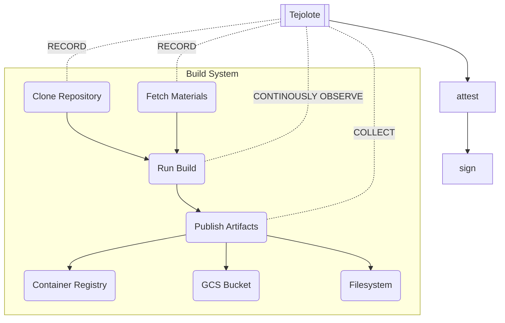
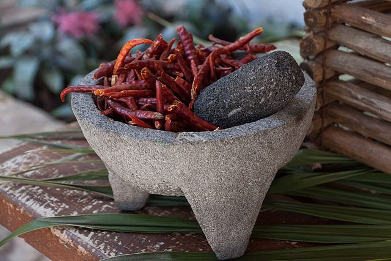

# tejolote

A highly configurable build executor and observer designed to generate 
signed [SLSA](https://slsa.dev/) provenance attestations about build runs.

## WTF Does That Mean?

If you are not familiar with
[provenance](https://www.tiktok.com/@chainguard_dev/video/7133203786927050027) attestations, think of them as non-falsifiable documents that inform you
users how software was built, mainly:

What went in → What was done to the source code (and by who) → what came out.

A provenance attestation provides users more transparency allowing them
to know where the software they are using came from.

## Key Features

Tejolote is designed to observe build systems as they run to gather data
about transformations done to software as it goes through the build process.
It features a pluggable model to add more build systems and artifact
storage as the need arises.

* Support for multiple build systems (currently 
[Google Cloud Build](https://cloud.google.com/build), 
[Github Actions](https://github.com/features/actions), 
[Prow](https://github.com/kubernetes/test-infra/tree/master/prow) 
coming soon).
* Support for gathering attestation data in multiple stages or observing a build
while it runs.
* Collection of artifacts from different sources (build system native, 
directories, OCI registries, Google Cloud Storage buckets).
* Attestation signing using [sigstore](https://sigstore.dev)
* Attaching attestations to container images as cosign

## Operational Model

Tejolote watches your build system build (or transform) your software
project. It treats your build as a black box and makes no assumptions as
to the security of the build itself.

It will trust the inputs you tell it to consider and the artifacts your
build produces by looking a the location you instruct it too look for them. 

While build systems can themselves provide information about the
artifacts produced after a run, Tejolote sits one level above and
will expect artifacts to appear in the storage location(s) you
tell it to monitor.

## What's with the name?

Tejolote /ˌteɪhəˈloʊteɪ/ : From the nahua word _texolotl_. 

A tejolote is the handle of the [_molcajete_](https://en.wikipedia.org/wiki/Molcajete), the prehispanic mortar used to make 
salsa.

So, the idea is to use tejolote to get some salsa out of your project :)
